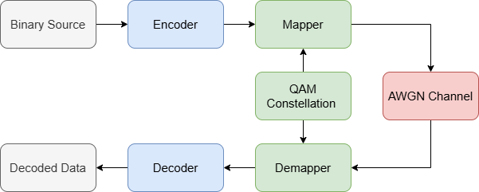
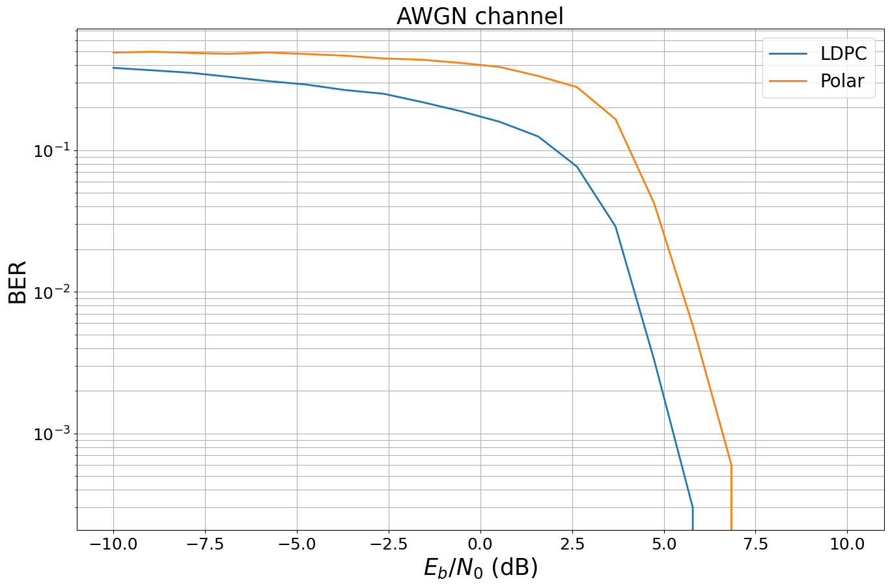
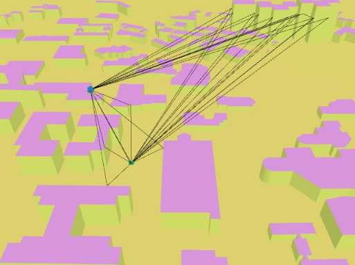
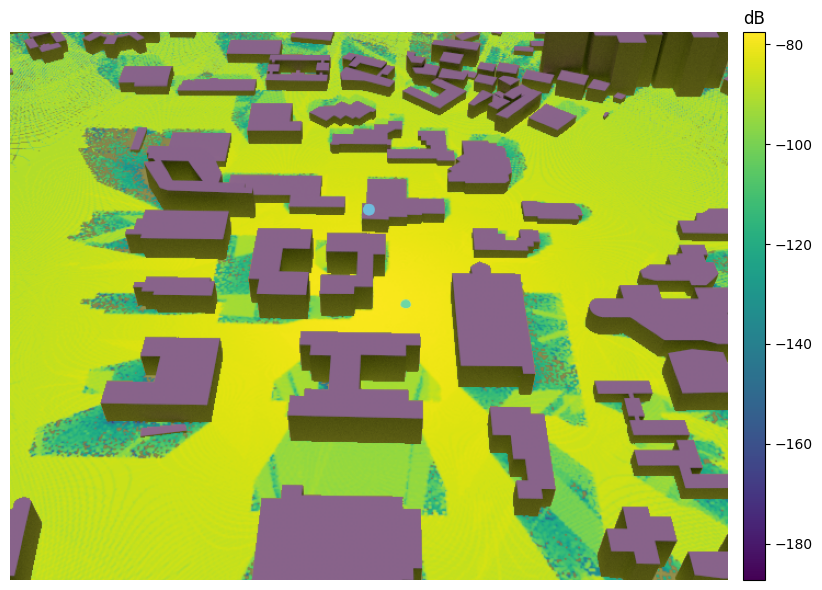

# NVIDIA Sionna: An Open-Source Library for 6G Physical-Layer Research

## 概述

Sionna是由NVIDIA開發的開源通訊函式庫，專為下一代無線通訊系統的研究與設計打造而成。它整合了通訊系統與深度學習模組，使研究人員能夠輕鬆設計、測試以及最佳化通訊系統。

## 核心特色

### 基於TensorFlow的架構

Sionna建立在TensorFlow之上，具有以下優勢：
- 原生GPU加速
- 平行化的模擬能力
- 與深度學習框架之整合

### Link Level通訊系統設計

Sionna支援完整通訊的建模與模擬：
- 訊號源編碼/解碼
- 調變/解調
- 通道編碼/解碼
- 通道估測

### 高自由度

- 模組化功能設計
- 支援使用者自定義模型


## 實際應用
### 基礎教學
規劃中...
### 應用一：Link Level通訊模擬
[Demo_LDPC_vs_Polar](sample_code/Demo_LDPC_vs_Polar.ipynb)
下圖為一個簡單的通訊系統模擬架構，從訊號源到Channel coding與Modulation，到經過Channel後的Demodulation以及Channel decoding，最後得到資料



### 應用二：Ray tracing模擬
[Demo_ray_tracing](sample_code/Demo_ray_tracing.ipynb)



### 應用三：Neural Receiver
規劃中...

## Setup

### Windows WSL
* 到BIOS打開虛擬化
* 用系統管理員權限打開Powershell並安裝WSL
```
wsl --install
```
* 安裝WSL的Ubuntu22.04，去Windows的應用程式商店下載 (之後Ubuntu的資料夾路徑會出現在檔案總管的Linux的位置)
* 打開Ubuntu，並參考以下Ubuntu的教學
### Ubuntu
* 打開Terminal並輸入以下指令
```
sudo apt update && sudo apt upgrade -y
sudo apt install llvm
```
* 下載&安裝conda
```
wget https://repo.anaconda.com/archive/Anaconda3-2024.10-1-Linux-x86_64.sh
bash Anaconda3-2024.10-1-Linux-x86_64.sh
```
* 建立虛擬環境
```
conda create --name sionna_env python=3.9
conda activate sionna_env
```
* 安裝套件
```
pip install tensorflow==2.14.0
pip install sionna
pip install jupyter notebook
conda install -c conda-forge libstdcxx-ng
```

* 安裝Cuda，以Cuda11.8為例 (如果可以使用的話)
```
wget https://developer.download.nvidia.com/compute/cuda/11.8.0/local_installers/cuda_11.8.0_520.61.05_linux.run
sudo sh cuda_11.8.0_520.61.05_linux.run --silent --toolkit
```
安裝Cudnn(需先下載，以cudnn-linux-x86_64-8.9.7.29_cuda11-archive.tar.xz為例)
```
tar -xvf cudnn-linux-x86_64-8.9.7.29_cuda11-archive.tar.xz
sudo cp cudnn-linux-x86_64-8.9.7.29_cuda11-archive/include/cudnn* /usr/local/cuda-11.8/include
sudo cp cudnn-linux-x86_64-8.9.7.29_cuda11-archive/lib/libcudnn* /usr/local/cuda-11.8/lib64/
sudo chmod a+r /usr/local/cuda-11.8/include/cudnn* /usr/local/cuda-11.8/lib64/libcudnn*
```
設定Cuda路徑，在.bashrc裡面加上
```
export CUDA_HOME=/usr/local/cuda-11.8
export PATH=$PATH:$CUDA_HOME/bin
export LD_LIBRARY_PATH=$LD_LIBRARY_PATH:$CUDA_HOME/lib64
```
在Terminal輸入
```
source .bashrc
```

處理WSL的Mitsuba環境(失敗)
```
bash NVIDIA-Linux-x86_64-*.run -x --target driver

mkdir driver-dist

sudo ln -s /usr/lib/wsl/lib/libcuda.so /usr/lib/x86_64-linux-gnu/

mkdir driver-dist && cp driver/libnvoptix.so.* driver-dist/libnvoptix.so.1 && cp driver/libnvidia-ptxjitcompiler.so.* driver-dist/libnvidia-ptxjitcompiler.so.1 && cp driver/libnvidia-rtcore.so.* driver-dist && cp driver/libnvidia-compiler.so.* driver-dist && cp driver/nvoptix.bin driver-dist && explorer.exe driver-dist && explorer.exe "C:\Windows\System32\lxss\lib"

cp driver/libnvoptix.so.* driver-dist/libnvoptix.so.1 && cp driver/libnvidia-ptxjitcompiler.so.* driver-dist/libnvidia-ptxjitcompiler.so.1 && cp driver/libnvidia-rtcore.so.* driver-dist && cp driver/libnvidia* driver-dist && explorer.exe driver-dist && explorer.exe "C:\Windows\System32\lxss\lib"
```
Reference
* NVIDIA website: https://developer.nvidia.com/sionna
* Sionna tutorial: https://nvlabs.github.io/sionna/index.html
* Sionna GitHub: https://github.com/NVlabs/sionna
