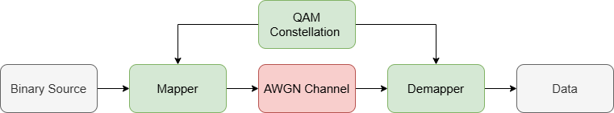
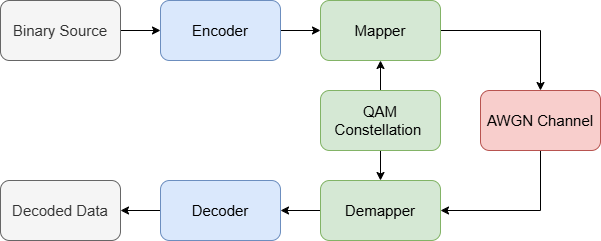
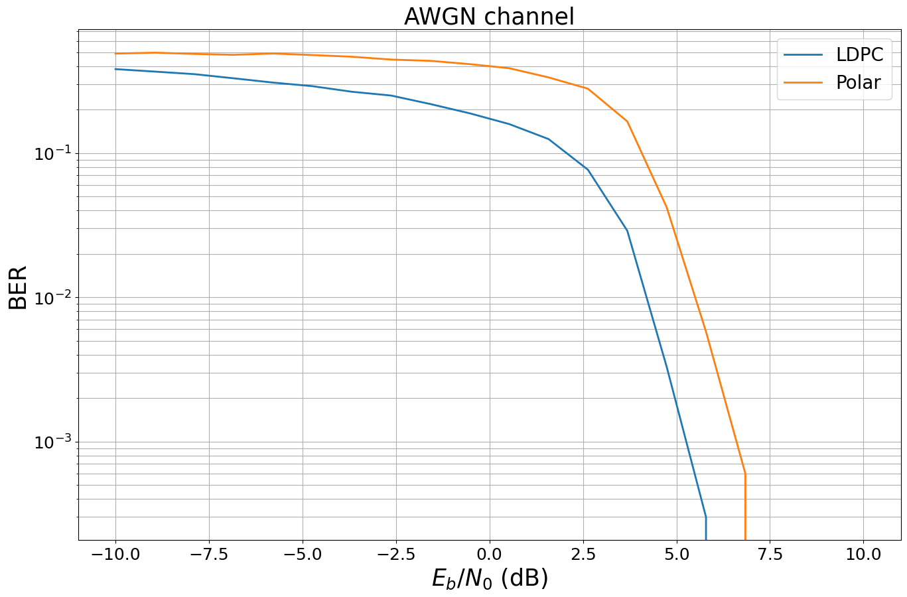
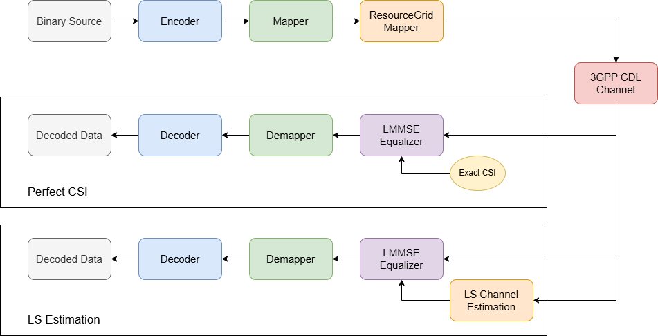
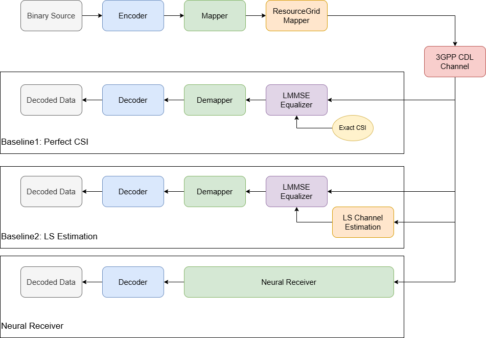
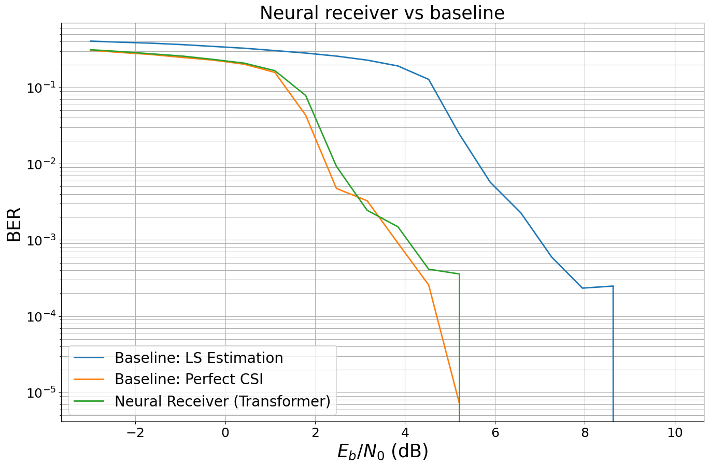
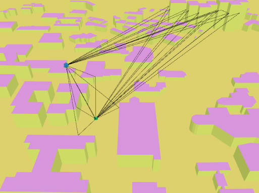
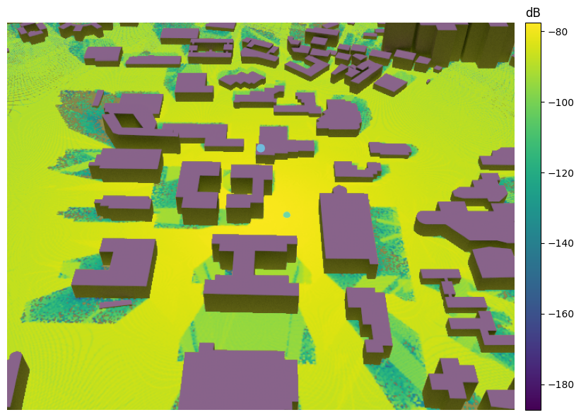

# NVIDIA Sionna: An Open-Source Library for Research on Communication Systems

## 概述

Sionna是由NVIDIA開發的開源通訊函式庫，專為下一代無線通訊系統的研究與設計打造而成。它整合了通訊系統與深度學習模組，使研究人員能夠輕鬆設計、測試以及最佳化通訊系統。

## 核心特色

### 基於Pytorch的架構

Sionna建立在Pytorch之上，具有以下優勢：
- 原生GPU加速
- 平行化的模擬能力
- 與深度學習框架之整合

### Link Level通訊系統設計

Sionna支援完整通訊的建模與模擬：
- 訊號源生成
- 通道編碼/解碼
- 調變/解調
- 通道估測
- 性能評估

### 高自由度

- 模組化功能設計
- 支援使用者自定義模型

## Setup

### 環境要求
* OS：不限
* Python 3.11+ 
* PyTorch 2.9+

### 安裝步驟
* 下載&安裝Anaconda，可到 https://repo.anaconda.com/archive/ 下載
* 使用conda建立虛擬環境
```
conda create --name sionna_env python=3.13
conda activate sionna_env
```
* 安裝PyTorch，指令可參考 https://pytorch.org/get-started/locally/
* 安裝完PyTorch後，安裝以下套件
```
pip install sionna
pip install jupyter
```


## 應用範例
### Case 1 : Basic Usage of Sionna
[Demo_sionna_basic](sample_code/Demo_sionna_basic.ipynb)

在此教學中將學習如何使用Sionna建立一個簡單的End-to-end通訊系統。從二進位的原始資料到訊號的Modulation、Channel、Demodulation，最後還原出二進位原始資料並計算其Bit error rate(BER)
<figure>
  
  <figcaption>圖1：簡易End-to-end通訊架構</figcaption>
</figure>

### Case 2 : Channel Coding and Performance Evaluation
[Demo_LDPC_vs_Polar](sample_code/Demo_LDPC_vs_Polar.ipynb)

在Case 2建立了一個包含Channel coding具有功能的通訊系統模擬架構(如圖2)，包含了從二進位的原始資料生成到Channel coding與Modulation，到經過Channel後的Demodulation以及Channel decoding，並在最後還原出二進位的原始資料，以及比較LDPC和Polar兩種編碼方式的BER測試結果(圖3)。
<figure>
  
  <figcaption>圖2：簡易End-to-end通訊架構</figcaption>
</figure>


<figure>
  
  <figcaption>圖3：LDPC和Polar的BER測試結果</figcaption>
</figure>

### Case 3 : Channel Estimation with OFDM

<figure>
  
  <figcaption>圖4：Channel estimation範例</figcaption>
</figure>


### Case 4 : Neural Receiver
[Demo_neural_receiver](sample_code/Demo_neural_receiver.ipynb)

在Case 4中建立了由神經網路構成的訊號接收器，從Channel estimation到Demodulation的步驟全部由AI來計算，並和基於LS estimation+Equalization以及Perfect CSI+Equalization的方法來進行比較(如圖5)。比較結果如圖6。
<figure>
  
  <figcaption>圖5：Neural receiver和Baseline的比較結果</figcaption>
</figure>

<figure>
  
  <figcaption>圖6：Neural receiver和Baseline的比較結果</figcaption>
</figure>


### Case 5 : Basic Ray Tracing
[Demo_ray_tracing](sample_code/Demo_ray_tracing.ipynb)

在Case 5中將實作基於交大校園地圖的Ray tracing模擬，包含了點對點的Ray tracing計算+圖像化(圖7)以及取得校園內的Radio map(圖8)。

<figure>
  
  <figcaption>圖7：點對點的Ray tracing模擬結果</figcaption>
</figure>
<figure>
  
  <figcaption>圖8：交大校園Radio map</figcaption>
</figure>


## References
* NVIDIA website: https://developer.nvidia.com/sionna
* Sionna tutorial: https://nvlabs.github.io/sionna/index.html
* Sionna GitHub: https://github.com/NVlabs/sionna
